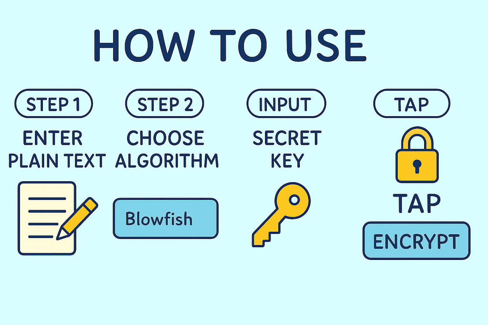
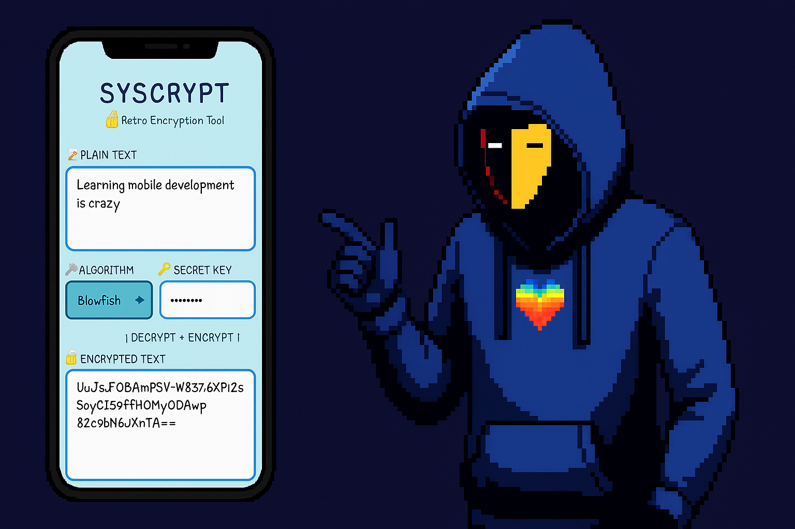
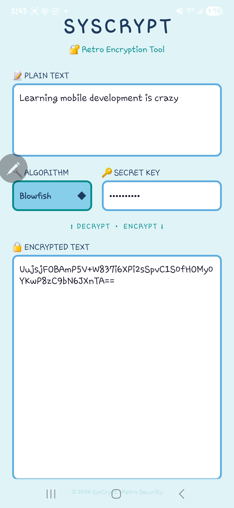

<p align="center">
  
</p>

<h1 align="center">🔐 SysCrypt</h1>

<p align="center">
  <strong>A retro-styled Android encryption & decryption tool for secure password protection</strong>
</p>

<p align="center">
  <a href="https://github.com/Sys-Redux"></a>
  <a href="https://www.linkedin.com/in/t-edge/"></a>
  <a href="https://www.sysredux.xyz"></a>
  <a href="https://x.com/sys_redux"></a>
  <a href="https://discord.gg/KdfApwrBuW"></a>
  <a href="https://www.upwork.com/freelancers/~011b4cf7ebf1503859?mp_source=share"></a>
  <a href="https://www.freelancer.com/u/trevoredge?frm=trevoredge&sb=t"></a>
</p>

<p align="center">
  
  
  
  
  
</p>

---

## 📖 About

I built **SysCrypt** as a sleek, retro-inspired Android application designed for encrypting and decrypting sensitive text using industry-standard cryptographic algorithms. Whether you're securing passwords, private messages, or any confidential data, SysCrypt provides real-time encryption with a nostalgic 90s aesthetic that makes security feel fun.

The app features **live encryption/decryption** — as you type, your text is instantly transformed, making it seamless to work with encrypted content without extra button clicks.

<p align="center">
  
</p>

---

## ✨ Features

- 🔄 **Real-time Encryption/Decryption** — Text transforms as you type
- 🔐 **Multiple Encryption Algorithms** — AES, DES, RSA, and Blowfish
- 🎨 **Retro 90s UI Design** — Clean, nostalgic light-blue color palette
- 📱 **Modern Android Support** — SDK 24 to 36 compatibility
- 🔑 **Password-Based Key Derivation** — Secure key generation from user passphrases
- 📋 **Bi-directional Processing** — Encrypt plain text or decrypt cipher text seamlessly
- ⚡ **Lightweight & Fast** — Minimal dependencies, optimized performance

<p align="center">
  
</p>

---

## 🛠️ Technologies Used

| Category | Technology |
|----------|------------|
| **Language** | Java 11 |
| **Platform** | Android (API 24-36) |
| **Build System** | Gradle 8.13.1 with Kotlin DSL |
| **UI Framework** | Android Views + ConstraintLayout |
| **Material Design** | Material Components 1.10.0 |
| **Cryptography** | Java Cryptography Architecture (JCA) |
| **IDE** | Android Studio |

### Encryption Algorithms

| Algorithm | Type | Key Size | Use Case |
|-----------|------|----------|----------|
| **AES** | Symmetric | 128-bit (SHA-256 derived) | General purpose, high security |
| **DES** | Symmetric | 56-bit (MD5 derived) | Legacy compatibility |
| **Blowfish** | Symmetric | Variable (4-56 bytes) | Fast encryption |
| **RSA** | Asymmetric | 2048-bit | Public key cryptography |

---

## 🏗️ Architecture

```
com.syscrypt/
├── MainActivity.java          # Main UI controller with real-time listeners
└── crypto/
    ├── CryptoEngine.java      # Interface for encryption engines
    ├── CryptoManager.java     # Factory & orchestrator for crypto operations
    ├── AESCrypto.java         # AES-128 CBC implementation
    ├── DESCrypto.java         # DES CBC implementation
    ├── BlowfishCrypto.java    # Blowfish CBC implementation
    └── RSACrypto.java         # RSA 2048-bit with deterministic key generation
```

The app follows a **Strategy Pattern** for cryptographic operations, making it easy to add new encryption algorithms without modifying existing code.

---

## 🚀 Getting Started

### Prerequisites

- Android Studio Arctic Fox or later
- JDK 11+
- Android SDK 36

### Installation

1. **Clone the repository**
   ```bash
   git clone https://github.com/Sys-Redux/SysCrypt.git
   cd SysCrypt
   ```

2. **Open in Android Studio**
   - File → Open → Select the project directory

3. **Build the project**
   ```bash
   ./gradlew assembleDebug
   ```

4. **Run on device/emulator**
   - Connect your Android device or start an emulator
   - Click "Run" in Android Studio

---

## 📱 Usage

<p align="center">
  
</p>

1. **Enter your secret key** in the key input field
2. **Select an encryption algorithm** from the dropdown (AES, DES, RSA, or Blowfish)
3. **Type in the plain text field** — encrypted output appears automatically below
4. **Or paste encrypted text** in the bottom field — decrypted text appears above

> 💡 **Tip:** The encryption/decryption happens in real-time as you type!

<p align="center">
  
</p>

---

## 🔒 Security Notes

- All cryptographic operations use the **Java Cryptography Architecture (JCA)**
- Keys are derived from passphrases using **SHA-256** (AES) or **MD5** (DES) hashing
- RSA uses **deterministic key generation** from passphrases for consistent encrypt/decrypt
- CBC mode with **PKCS5Padding** is used for symmetric algorithms
- Encrypted output is **Base64 encoded** for safe text transmission

⚠️ **Disclaimer:** This app is intended for educational and personal use. For production security applications, consider using established security libraries and following current best practices.

---

## 🤝 Connect With Me

I'm always open to collaborating on interesting projects or discussing development opportunities. Feel free to reach out!

<p align="center">
  <a href="https://github.com/Sys-Redux">GitHub</a> •
  <a href="https://www.linkedin.com/in/t-edge/">LinkedIn</a> •
  <a href="https://www.sysredux.xyz">Website</a> •
  <a href="https://x.com/sys_redux">X</a> •
  <a href="https://discord.gg/KdfApwrBuW">Discord</a> •
  <a href="https://www.upwork.com/freelancers/~011b4cf7ebf1503859?mp_source=share">Upwork</a> •
  <a href="https://www.freelancer.com/u/trevoredge?frm=trevoredge&sb=t">Freelancer</a>
</p>

---

## 📄 License

This project is open source and available for personal and educational use.

---

<p align="center">
  <strong>© 2024 SysCrypt • Retro Security</strong>
</p>
